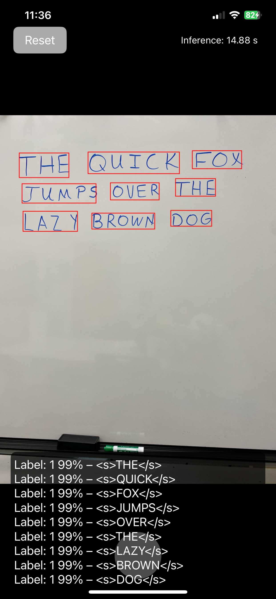

===================================================
         iOS Object Detection & OCR Inference
===================================================

Overview:
---------
This iOS project demonstrates real-time image processing by capturing photos using the device’s camera and performing on-device inference using two ONNX models:
  • DETR (Detection Transformer) for object detection 
  • TrOCR for Optical Character Recognition (OCR)

The application captures an image, processes it to detect objects, draws bounding boxes on the detected regions, and extracts text from these regions using OCR. It integrates Apple's AVFoundation for camera access and onnxruntime_objc to run ONNX models in Swift.

Features:
---------
• Real-time camera capture with AVCaptureSession.
• Object detection using a DETR ONNX model.
• Cropping and drawing bounding boxes around detected objects.
• OCR processing on detected regions using TrOCR (encoder & decoder models).
• Beam search decoding with vocabulary mapping to generate recognized text.
• Displays inference timings and OCR results on screen.
• Simple UI for capturing images and resetting to camera mode.

Requirements:
-------------
• Xcode 11 or later.
• iOS 12.0+ (or higher) with Swift 5.
• onnxruntime_objc integration (via CocoaPods, Carthage, or Swift Package Manager).
• The following ONNX model files must be added to your project bundle:
    - detr.ort             (DETR detection model)
    - encoder_model_quantized.ort    (TrOCR encoder)
    - decoder_model_quantized.ort    (TrOCR decoder)
    - vocab.json           (Vocabulary mapping for TrOCR)

Installation & Setup:
---------------------
1. Clone or add the project files into an Xcode project.
2. Integrate the onnxruntime_objc library and ensure all required frameworks are linked.
3. Add the model files (detr.ort, encoder_model_quantized.ort, decoder_model_quantized.ort, vocab.json)
   to your project bundle. Verify they are included in the “Copy Bundle Resources” section.
4. Update your Info.plist with the necessary usage description keys:
   - NSCameraUsageDescription (to allow camera access).

Running the App:
----------------
1. Open the project in Xcode.
2. Build and run the app on a device or simulator with camera support.
3. On launch, the app displays the camera preview. Tap the capture button to take a photo.
4. After capturing, the app:
   - Stops the camera session,
   - Runs object detection (DETRInference),
   - Draws bounding boxes on the detected image,
   - Performs OCR (TrOCRInference) on each bounding box,
   - Displays the final image along with recognized text and inference times.
5. Tap the “Reset” button to resume camera capture for a new image.

Code Structure:
---------------
• ViewController.swift
   - Sets up the camera preview and UI components.
   - Handles photo capture and user interactions.
   - Manages the workflow: capture photo → inference → display results.
   
• DETRInference.swift
   - Contains methods for image preprocessing, tensor creation, and running DETR inference.
   - Processes the model’s outputs to extract bounding box coordinates and labels.
   - Draws the bounding boxes onto the captured image.
   
• TrOCRInference.swift
   - Handles initialization of the OCR encoder and decoder models.
   - Loads a vocabulary from vocab.json.
   - Preprocesses cropped images, runs OCR, and applies beam search decoding.
   - Post-processes and returns the recognized text.

How It Works:
-------------
1. **Camera Capture**: The app uses AVFoundation to capture images.
2. **Object Detection with DETR**: The captured image is preprocessed and passed to the DETR ONNX model. Detected objects’ bounding boxes are extracted, sorted, and drawn on the image.
3. **OCR with TrOCR**: Each detected region is cropped and sent to the TrOCR model. The encoder/decoder pipeline then applies beam search decoding to recognize and extract text.
4. **Display of Results**: The final output (bounding boxes and text) is shown in an image view and text view, along with inference timing information.

RL Examples:
------------

Troubleshooting:
----------------
• *Camera Access*: If the camera does not launch, verify that the app has permission (check Info.plist for NSCameraUsageDescription).
• *Model Files*: Ensure that detr.ort, encoder_model_quantized.ort, decoder_model_quantized.ort, and vocab.json are correctly added to the project bundle.
• *Inference Errors*: Check the debug console for log messages. Errors during preprocessing, tensor creation, or inference usually indicate issues with model integration or incorrect file paths.

License & Acknowledgements:
---------------------------
• (Include your license information here, e.g., MIT License.)
• This project utilizes the onnxruntime_objc library for running ONNX models on iOS.
• Thanks to the contributors of DETR (Facebook) and TrOCR (Microsoft) models for providing the research and pre-trained models.

Contact:
--------
For questions, suggestions, or contributions, please contact:
  David Nystrom – dgnystro@uark.edu OR davidgnystrom@gmail.com

===================================================
